# CaSiCaS Application — System Documentation

> **Version:** 2.0  
> **Date:** March 2026  
> **Status:** Production  
> **Repository:** [CaSiCas-Application-IPT](https://github.com/jamesgwapo123-coder/CaSiCas-Application-IPT)

---

## Table of Contents

1. [Introduction](#1-introduction)
2. [Problem Statement & Why CaSiCaS Exists](#2-problem-statement--why-casicas-exists)
3. [How It Works](#3-how-it-works)
4. [Why It Works](#4-why-it-works)
5. [Technology Stack](#5-technology-stack)
6. [System Architecture](#6-system-architecture)
7. [Features & Functionalities](#7-features--functionalities)
8. [Core Functions Reference](#8-core-functions-reference)
9. [Database Schema](#9-database-schema)
10. [Security Architecture](#10-security-architecture)
11. [System Flowcharts](#11-system-flowcharts)
12. [How CaSiCaS Helps People & Solves Problems](#12-how-casicas-helps-people--solves-problems)
13. [Deployment & Infrastructure](#13-deployment--infrastructure)
14. [File Structure](#14-file-structure)
15. [Conclusion](#15-conclusion)

---

## 1. Introduction

**CaSiCaS** (from the Cebuano words *"Calit"* — find, *"Siling"* — look, *"Cas"* — you) is a **geo-fenced local marketplace web application** purpose-built for the people of **Cebu, Philippines**. It enables users to buy, sell, and discover items and services pinned on an interactive map, with every listing tied to a real geographic location.

Unlike general-purpose platforms such as Facebook Marketplace or OLX, CaSiCaS leverages **geolocation technology** to restrict listing visibility to a user's neighborhood radius — from as close as **1 km** to a maximum of **50 km** — ensuring that every transaction stays hyper-local, safe, and convenient.

The application is a modern **Single-Page Application (SPA)** with a **React 19** frontend communicating directly with **Supabase** (a Backend-as-a-Service built on PostgreSQL), and uses **Mapbox GL JS** for interactive map-based browsing.

### Key Highlights

| Metric | Value |
|---|---|
| Frontend Framework | React 19 + Vite 7 |
| Backend/Database | Supabase (PostgreSQL) |
| Map Provider | Mapbox GL JS |
| Authentication | Supabase Auth (JWT-based) |
| Real-Time Engine | Supabase Realtime (PostgreSQL CDC) |
| Deployment | Railway (Frontend & Backend) |
| Target Region | Cebu, Philippines |

---

## 2. Problem Statement & Why CaSiCaS Exists

### The Problem

In Cebu, local buying and selling happens primarily through:

1. **Facebook Marketplace** — No geo-fencing; listings from Manila can appear for Cebuano users. No map-based browsing. Heavily dependent on the Facebook ecosystem.
2. **Informal group chats** — No structured listing format, no search, no accountability.
3. **Physical bulletin boards** — Limited reach, no real-time updates, no messaging.

**Key pain points:**

- Buyers see listings from users **hundreds of kilometers away**, leading to wasted time.
- No map-based visualization — users cannot see *where* a listing physically is.
- No structured category filtering for local contexts.
- No privacy-first approach — users are forced to share personal social media accounts.

### The Solution

CaSiCaS solves these problems by:

- **Geo-fencing all listings** — Users set a radius and only see items within that distance.
- **Map-first browsing** — Every listing is a pin on an interactive Mapbox map.
- **Built-in messaging** — In-app real-time chat eliminates the need for third-party communication.
- **Category-based filtering** — 7 structured categories (Electronics, Furniture, Clothing, Vehicles, Food, Services, Other).
- **Role-based accounts** — Users register as either *Buyer* or *Seller*, streamlining the experience.

---

## 3. How It Works

### User Journey (End-to-End)

```
1. User visits CaSiCaS landing page
2. User registers as Buyer or Seller
3. Supabase Auth creates a JWT-authenticated session
4. User profile is stored in the `profiles` table
5. User accesses the Marketplace
6. Mapbox map loads centered on Cebu City (10.3157°N, 123.8854°E)
7. Listings are fetched from Supabase `listings` table
8. Each listing is rendered as a map marker (GeoJSON)
9. User adjusts radius slider (0–50 km) → listing filter updates
10. User clicks a marker → popup shows listing details
11. User clicks "Chat" → in-app conversation starts
12. Messages are sent via Supabase and synced in real-time via PostgreSQL CDC
13. Seller manages listings from the Dashboard — CRUD operations
```

### Data Flow

```
Browser (React SPA)
  │
  ├── Authentication ──→ Supabase Auth (JWT tokens)
  ├── Database Queries ──→ Supabase Client SDK ──→ PostgreSQL
  ├── File Uploads ──→ Supabase Storage (S3-compatible)
  ├── Real-time Chat ──→ Supabase Realtime (WebSocket/CDC)
  └── Map Rendering ──→ Mapbox GL JS (Vector tiles)
```

---

## 4. Why It Works

### Technical Rationale

| Design Decision | Rationale |
|---|---|
| **Supabase instead of custom backend** | Eliminates server maintenance; provides auth, database, storage, and real-time out of the box. Reduces attack surface. |
| **React 19 SPA** | Fast client-side navigation, component reuse, and declarative UI. Hooks-based architecture with Context API for state management. |
| **Mapbox GL JS** | Industry-leading map rendering with WebGL, supports GeoJSON, custom markers, popups, radius circles, 3D terrain, and style switching. |
| **PostgreSQL (via Supabase)** | ACID-compliant relational database with Row Level Security (RLS), full-text search support, and real-time change data capture. |
| **Direct Supabase Client** | The frontend communicates directly with Supabase using the `@supabase/supabase-js` SDK, bypassing the need for a custom REST API. |
| **Geo-fencing via radius filtering** | The radius slider draws a calculated polygon (64-point circle) on the map and filters listings by haversine-approximate distance. |
| **JWT-based authentication** | Stateless auth — no server-side sessions to manage. Tokens are cryptographically signed and verified by Supabase. |

### Architectural Benefits

- **Zero custom API server needed** — All CRUD operations go through Supabase.
- **Real-time by default** — PostgreSQL Change Data Capture (CDC) powers live chat.
- **Horizontally scalable** — Supabase handles scaling of database, auth, and storage.
- **Offline-resilient** — Static assets served via CDN; database interactions are async.

---

## 5. Technology Stack

### Frontend

| Technology | Version | Purpose |
|---|---|---|
| **React** | 19.2.0 | UI framework — component-based SPA |
| **React DOM** | 19.2.0 | DOM rendering for React |
| **React Router DOM** | 7.13.1 | Client-side routing (`/`, `/login`, `/register`, `/marketplace`, `/dashboard`) |
| **Vite** | 7.3.1 | Build tool — HMR, fast bundling, ES module dev server |
| **@supabase/supabase-js** | 2.97.0 | Supabase client SDK — auth, database, storage, realtime |
| **Mapbox GL JS** | 3.18.1 | Interactive WebGL maps — markers, popups, GeoJSON layers |
| **Lenis** | 1.3.17 | Smooth scroll library for premium scrolling UX |
| **Vanilla CSS** | — | Custom design system — no CSS framework dependency |

### Backend / Infrastructure

| Technology | Purpose |
|---|---|
| **Supabase** | Backend-as-a-Service: PostgreSQL, Auth, Storage, Realtime |
| **PostgreSQL** | Relational database (hosted by Supabase) |
| **Supabase Auth** | User authentication with JWT tokens |
| **Supabase Storage** | S3-compatible file storage for images |
| **Supabase Realtime** | WebSocket-based real-time subscriptions (PostgreSQL CDC) |
| **Django 6** | Legacy backend (retained for API compatibility / migration) |
| **Django REST Framework** | REST API endpoints (legacy) |
| **Railway** | Cloud deployment platform (frontend + backend) |

### Development Tools

| Tool | Purpose |
|---|---|
| **ESLint** | JavaScript linting |
| **Git / GitHub** | Version control and collaboration |
| **nixpacks** | Railway build system configuration |

---

## 6. System Architecture

### High-Level Architecture Diagram

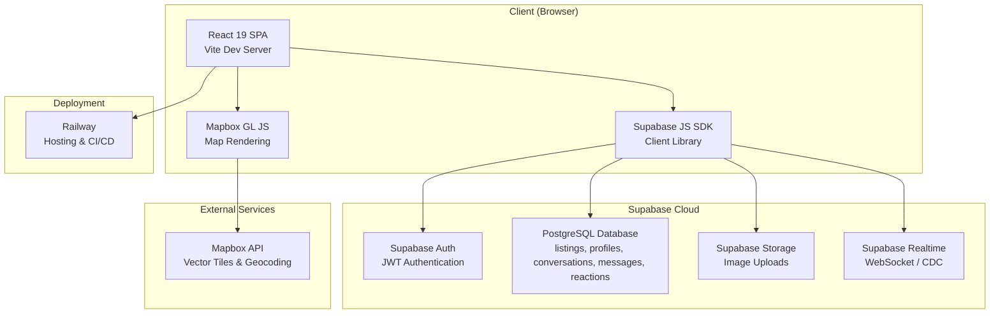

### Component Architecture Diagram

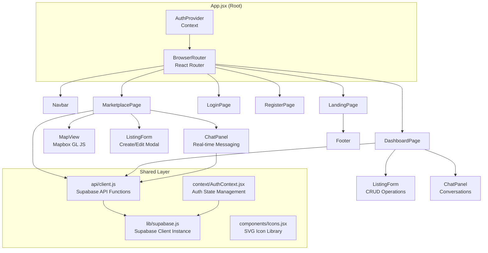

---

## 7. Features & Functionalities

### 7.1 User Authentication

| Feature | Description |
|---|---|
| **Sign Up** | Two-column register page: left = form (role picker, name, username, email, password), right = branding panel with motivational quote |
| **Sign In** | Clean login form with SVG icon-prefixed inputs (User, Lock) and show/hide password toggle |
| **Session Persistence** | JWT tokens stored in browser; auto-refreshed by Supabase SDK |
| **Auth State Listener** | `onAuthStateChange` hooks detect login/logout across tabs |
| **Profile Management** | User profile stored in `profiles` table with username, role, bio, phone, avatar, ratings, and transaction stats |
| **Icon-Based UI** | All auth forms use custom SVG icons (14+ icons in `Icons.jsx`) instead of text labels or emojis |

### 7.2 Marketplace (Map-Based Browsing)

| Feature | Description |
|---|---|
| **Interactive Map** | Full-screen Mapbox GL map centered on Cebu City |
| **GeoJSON Markers** | Each listing rendered as a dot marker with label (black = Sell, white = Buy) |
| **Hover Popups** | Mouse hover shows listing image, title, price, category |
| **Click Navigation** | Clicking a marker scrolls the side panel to the listing card |
| **Category Filter** | Dropdown filter: Electronics, Furniture, Clothing, Vehicles, Food, Services, Other |
| **Type Filter** | Filter by "For Sale" or "Want to Buy" |
| **Radius Slider** | 0–50 km radius slider with visual circle overlay on map |
| **Map Style Switcher** | 5 styles: Streets, Light, Dark, Satellite, 3D Terrain |
| **Geolocation** | Browser GPS integration for "locate me" functionality |
| **Responsive Layout** | Map stacks above listings panel on mobile (40vh/60vh split) |

### 7.3 Listing Management (CRUD)

| Operation | Description |
|---|---|
| **Create** | Modal form: title, description, price (₱), category, type (Sell/Buy), photo upload, address, lat/lng coordinates |
| **Read** | View listings in panel grid cards and on map markers |
| **Update** | Edit existing listings with pre-populated form |
| **Delete** | Delete listings with confirmation dialog |
| **Image Upload** | Images uploaded to Supabase Storage with auto-generated public URLs |

### 7.4 Real-Time Messaging

| Feature | Description |
|---|---|
| **Conversation List** | View all conversations with avatar initials, listing context, last message preview, and unread count |
| **Auto-Create Conversation** | Clicking "Chat" on a listing auto-creates a buyer–seller conversation |
| **Real-Time Messages** | Messages sync instantly via Supabase Realtime (PostgreSQL CDC) |
| **Image Sharing** | Attach and send images within chat (uploaded to `chat-images` bucket) |
| **Emoji Reactions** | React to messages with ❤️ 👍 😂 😮 😢 — toggle on/off |
| **Read Receipts** | Unread message count displayed per conversation |
| **SVG Icon Controls** | Send, attach, back, close, and reaction buttons all use SVG icons |
| **Keyboard Shortcuts** | Press Enter to send, Shift+Enter for newline |

### 7.5 Dashboard

| Feature | Description |
|---|---|
| **My Listings Tab** | View all listings created by the current user with edit/delete actions |
| **Messages Tab** | View all conversations with avatar circles and open chat panel |
| **Profile Tab** | Avatar with upload overlay, stats row (total sales, purchases, star rating), account details with icons, inline edit form for phone/bio |
| **Avatar Upload** | Profile picture upload to Supabase `avatars` storage bucket; initials fallback if no photo |
| **Star Rating** | 5-star rating display with filled/empty stars, average score, and review count |
| **Quick Actions** | Edit or delete listings directly from dashboard cards |

### 7.6 User Ratings

| Feature | Description |
|---|---|
| **Buyer Rates Seller** | After a purchase, buyers can rate sellers (1–5 stars) with an optional text review |
| **Rating Constraints** | One rating per buyer per listing (enforced by unique constraint) |
| **Auto-Recalculation** | Seller's average rating and review count are auto-recalculated on each new rating |
| **Profile Display** | Star rating and total reviews shown on the seller's profile stats row |

### 7.6 Landing Page

| Feature | Description |
|---|---|
| **Hero Video Section** | Full-viewport hero with background video overlay and CTAs |
| **Feature Cards** | Geo-Fenced, Map View, Local Community — 3 value propositions |
| **Stats Section** | 100+ listings, 7 categories, 50km max radius, 24/7 availability |
| **Demo Video Section** | Placeholder for walkthrough video |
| **CTA Section** | Account creation and marketplace browsing call-to-actions |

---

## 8. Core Functions Reference

### 8.1 Authentication Functions (`context/AuthContext.jsx`)

| Function | Signature | Description |
|---|---|---|
| `login` | `({ username, password }) → Promise` | Signs in via Supabase Auth; auto-generates email from username if needed (`username@casicas.local`) |
| `register` | `({ username, email, password, role, first_name, last_name }) → Promise` | Creates Supabase Auth user with metadata, then updates `profiles` table with role and name |
| `logout` | `() → Promise` | Signs out, clears user and profile state |
| `fetchProfile` | `(userId) → Promise<Profile>` | Fetches user profile (including avatar_url, rating, total_sales, total_purchases) from `profiles` table by ID |

### 8.2 Listing Functions (`api/client.js`)

| Function | Signature | Description |
|---|---|---|
| `getListings` | `(filters?) → Promise<Listing[]>` | Fetches all listings; supports category, listing_type, seller_id, and status filters |
| `getMyListings` | `() → Promise<Listing[]>` | Fetches listings owned by the current authenticated user |
| `createListing` | `(data) → Promise<Listing>` | Creates a new listing; handles image upload to Supabase Storage |
| `updateListing` | `(id, data) → Promise<Listing>` | Updates an existing listing by ID; supports image re-upload |
| `deleteListing` | `(id) → Promise<void>` | Deletes a listing by ID |

### 8.3 Messaging Functions (`api/client.js`)

| Function | Signature | Description |
|---|---|---|
| `getConversations` | `() → Promise<Conversation[]>` | Fetches all conversations for the current user with last message and unread count |
| `getOrCreateConversation` | `(listingId, sellerId) → Promise<Conversation>` | Finds existing or creates new buyer–seller conversation for a listing |
| `getMessages` | `(conversationId) → Promise<Message[]>` | Fetches all messages in a conversation with sender info and reactions |
| `sendMessage` | `(conversationId, text) → Promise<Message>` | Sends a text message and updates conversation timestamp |
| `sendMessageWithImage` | `(conversationId, text, imageFile) → Promise<Message>` | Sends a message with an attached image (uploaded to Supabase Storage) |
| `reactToMessage` | `(messageId, emoji) → Promise<{action}>` | Toggles an emoji reaction on a message (add/remove) |
| `markConversationRead` | `(conversationId) → Promise<void>` | Marks all unread messages in a conversation as read (for the current user) |

### 8.4 Profile & Rating Functions (`api/client.js`)

| Function | Signature | Description |
|---|---|---|
| `updateProfile` | `(profileData) → Promise<Profile>` | Updates the current user's profile fields (phone, bio, etc.) |
| `uploadAvatar` | `(file) → Promise<Profile>` | Uploads a profile picture to the `avatars` storage bucket and updates `avatar_url` in the profile |
| `rateSeller` | `(listingId, sellerId, score, review?) → Promise` | Submits a 1–5 star rating for a seller on a specific listing; auto-recalculates seller's average |
| `getSellerRatings` | `(sellerId) → Promise<Rating[]>` | Fetches all ratings for a specific seller with reviewer info |

### 8.5 Map Functions (`components/MapView.jsx`)

| Function | Description |
|---|---|
| `buildGeoJSON(listings)` | Converts listing array to GeoJSON FeatureCollection for Mapbox source |
| `addMarkerLayers(map)` | Adds circle dots, text labels, hover popups, and click handlers to the map |
| `updateRadiusCircle()` | Draws a 64-point polygon circle on the map representing the selected radius |

### 8.6 Real-Time Functions (`components/ChatPanel.jsx`)

| Function | Description |
|---|---|
| `subscribeToMessages(convId)` | Creates a Supabase Realtime channel subscription for new messages using PostgreSQL CDC |
| `handleReact(messageId, emoji)` | Sends an emoji reaction and reloads messages to reflect updated reaction summaries |

---

## 9. Database Schema

### Entity-Relationship Diagram

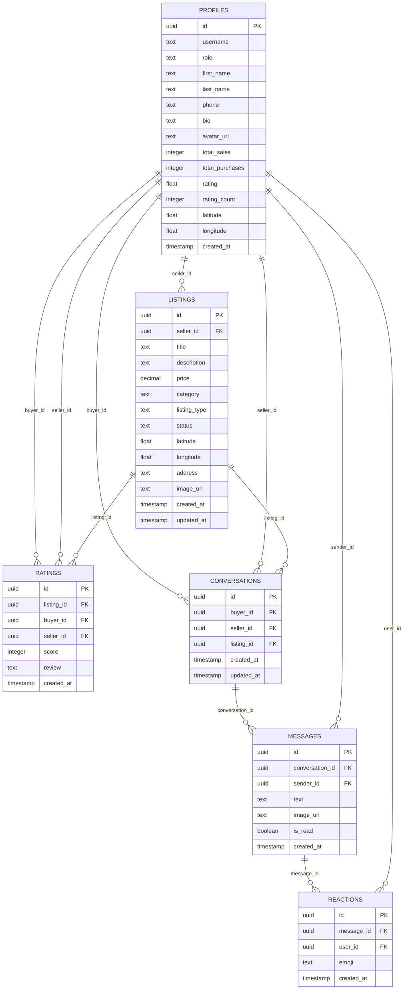

### Table Details

#### `profiles`
Stores user account information. Automatically created via Supabase Auth trigger.

| Column | Type | Constraints | Description |
|---|---|---|---|
| `id` | `uuid` | PK, FK → `auth.users` | User's unique identifier |
| `username` | `text` | NOT NULL, UNIQUE | Display name |
| `role` | `text` | DEFAULT `'buyer'` | `buyer` or `seller` |
| `first_name` | `text` | DEFAULT `''` | First name |
| `last_name` | `text` | DEFAULT `''` | Last name |
| `phone` | `text` | NULLABLE | Contact number |
| `bio` | `text` | NULLABLE | Short bio |
| `avatar_url` | `text` | DEFAULT `''` | Profile picture URL from Supabase Storage |
| `total_sales` | `integer` | DEFAULT `0` | Number of completed sales |
| `total_purchases` | `integer` | DEFAULT `0` | Number of completed purchases |
| `rating` | `float` | DEFAULT `0` | Average star rating (0–5) |
| `rating_count` | `integer` | DEFAULT `0` | Total number of reviews received |
| `latitude` | `float` | NULLABLE | User's default location |
| `longitude` | `float` | NULLABLE | User's default location |
| `created_at` | `timestamp` | DEFAULT `now()` | Account creation date |

#### `ratings`
Buyer-rates-seller reviews linked to specific listings.

| Column | Type | Constraints | Description |
|---|---|---|---|
| `id` | `uuid` | PK | Rating identifier |
| `listing_id` | `uuid` | FK → `listings` | The listing this rating is for |
| `buyer_id` | `uuid` | FK → `profiles` | Who submitted the rating |
| `seller_id` | `uuid` | FK → `profiles` | Who is being rated |
| `score` | `integer` | NOT NULL, 1–5 | Star rating value |
| `review` | `text` | NULLABLE | Optional text review |
| `created_at` | `timestamp` | DEFAULT `now()` | Rating submission date |

> **Constraint:** `UNIQUE(listing_id, buyer_id)` — one rating per buyer per listing.

#### `listings`
Items posted for sale or wanted-to-buy.

| Column | Type | Constraints | Description |
|---|---|---|---|
| `id` | `uuid` | PK, auto-generated | Listing identifier |
| `seller_id` | `uuid` | FK → `profiles` | Who posted the listing |
| `title` | `text` | NOT NULL | Item/service name |
| `description` | `text` | — | Detailed description |
| `price` | `decimal` | NOT NULL | Price in Philippine Peso (₱) |
| `category` | `text` | NOT NULL | One of: `electronics`, `furniture`, `clothing`, `vehicles`, `food`, `services`, `other` |
| `listing_type` | `text` | DEFAULT `'sell'` | `sell` or `buy` |
| `status` | `text` | DEFAULT `'active'` | `active`, `sold`, `closed` |
| `latitude` | `float` | NOT NULL | Pin location |
| `longitude` | `float` | NOT NULL | Pin location |
| `address` | `text` | — | Human-readable location |
| `image_url` | `text` | — | Public URL from Supabase Storage |
| `created_at` | `timestamp` | DEFAULT `now()` | Post date |
| `updated_at` | `timestamp` | DEFAULT `now()` | Last update |

#### `conversations`
Buyer–seller chat threads linked to a specific listing.

| Column | Type | Constraints | Description |
|---|---|---|---|
| `id` | `uuid` | PK | Conversation identifier |
| `buyer_id` | `uuid` | FK → `profiles` | Buyer in the conversation |
| `seller_id` | `uuid` | FK → `profiles` | Seller in the conversation |
| `listing_id` | `uuid` | FK → `listings` | The related listing |
| `created_at` | `timestamp` | DEFAULT `now()` | When conversation was started |
| `updated_at` | `timestamp` | DEFAULT `now()` | Last activity timestamp |

#### `messages`
Individual messages within a conversation.

| Column | Type | Constraints | Description |
|---|---|---|---|
| `id` | `uuid` | PK | Message identifier |
| `conversation_id` | `uuid` | FK → `conversations` | Parent conversation |
| `sender_id` | `uuid` | FK → `profiles` | Who sent the message |
| `text` | `text` | — | Message content |
| `image_url` | `text` | — | Attached image URL |
| `is_read` | `boolean` | DEFAULT `false` | Read receipt flag |
| `created_at` | `timestamp` | DEFAULT `now()` | Send timestamp |

#### `reactions`
Emoji reactions on messages.

| Column | Type | Constraints | Description |
|---|---|---|---|
| `id` | `uuid` | PK | Reaction identifier |
| `message_id` | `uuid` | FK → `messages` | Target message |
| `user_id` | `uuid` | FK → `profiles` | Who reacted |
| `emoji` | `text` | NOT NULL | Emoji character (❤️, 👍, 😂, 😮, 😢) |
| `created_at` | `timestamp` | DEFAULT `now()` | Reaction timestamp |

---

## 10. Security Architecture

### 10.1 Authentication Security

| Layer | Implementation | Details |
|---|---|---|
| **JWT Tokens** | Supabase Auth | Cryptographically signed JSON Web Tokens. Access tokens are short-lived; refresh tokens enable session continuity. |
| **Password Hashing** | bcrypt (Supabase/GoTrue) | Passwords are never stored in plain text. Supabase uses bcrypt with salt rounds. |
| **Session Management** | Client-side, auto-refresh | Sessions are maintained via `supabase.auth.getSession()` and `onAuthStateChange` listeners. |
| **CORS Protection** | Supabase default | Supabase enforces Cross-Origin Resource Sharing policies on all API endpoints. |

### 10.2 Database Security

| Layer | Implementation | Details |
|---|---|---|
| **Row Level Security (RLS)** | PostgreSQL RLS policies | Every table has RLS enabled. Policies ensure users can only read/write their own data or public data as applicable. |
| **API Key Scoping** | `anon` key | The frontend uses the Supabase `anon` (public) key, which is scoped to only allow operations permitted by RLS policies. |
| **Foreign Key Integrity** | PostgreSQL constraints | All relationships are enforced at the database level via foreign key constraints. |
| **Input Sanitization** | Supabase SDK | Parameterized queries prevent SQL injection. The SDK auto-sanitizes inputs. |

### 10.3 Storage Security

| Layer | Implementation | Details |
|---|---|---|
| **Bucket Policies** | Supabase Storage | Storage buckets (`listings`, `chat-images`, `avatars`) have access policies controlling who can upload and read files. |
| **File Path Isolation** | User ID prefix | All uploaded files are stored under the user's ID prefix (e.g., `{user_id}/timestamp_filename.jpg`), preventing path traversal. |
| **File Type Validation** | `accept="image/*"` | Frontend file inputs restrict uploads to image MIME types. |
| **Avatar Bucket** | Public read, auth write | `avatars` bucket: public read, authenticated upload, users can only update/delete their own files (enforced by folder-name matching). |

### 10.4 Client-Side Security

| Layer | Implementation | Details |
|---|---|---|
| **Environment Variables** | `import.meta.env` | Sensitive keys (Supabase URL, API key, Mapbox token) are loaded from `.env` via Vite's environment variable system. |
| **Route Protection** | AuthContext + `useNavigate` | Protected routes (Dashboard) redirect unauthenticated users to the login page. |
| **XSS Prevention** | React DOM escaping | React automatically escapes rendered content, preventing cross-site scripting via user-generated content. |
| **CSRF Protection** | JWT-based (no cookies) | Since authentication uses JWT in headers (not cookies), CSRF attacks are not applicable. |

### 10.5 Real-Time Security

| Layer | Implementation | Details |
|---|---|---|
| **Channel Authorization** | Supabase Realtime | Real-time channels use RLS policies to authorize which users can subscribe to which data changes. |
| **Message Integrity** | PostgreSQL CDC | Messages are sourced from PostgreSQL's write-ahead log, ensuring they cannot be tampered with in transit. |

### Security Summary

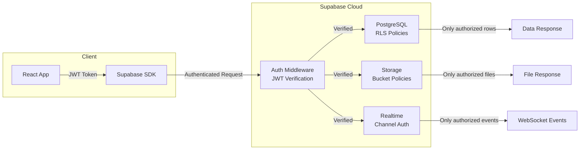

---

## 11. System Flowcharts

### 11.1 User Registration Flow

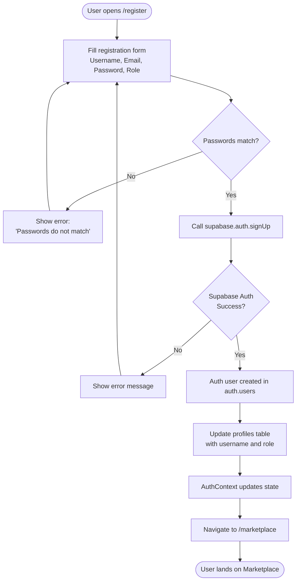

### 11.2 Login Flow

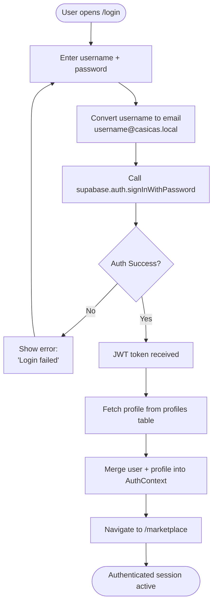

### 11.3 Listing Creation Flow

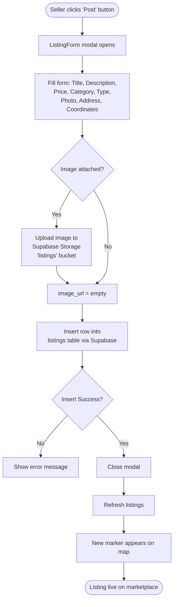

### 11.4 Marketplace Browsing Flow

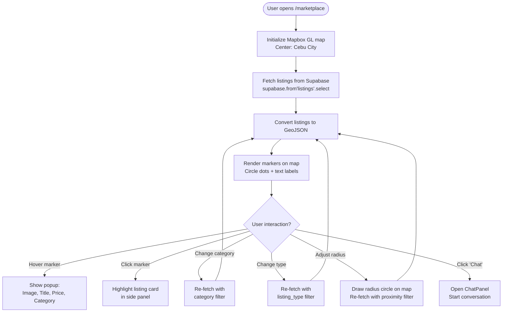

### 11.5 Real-Time Messaging Flow

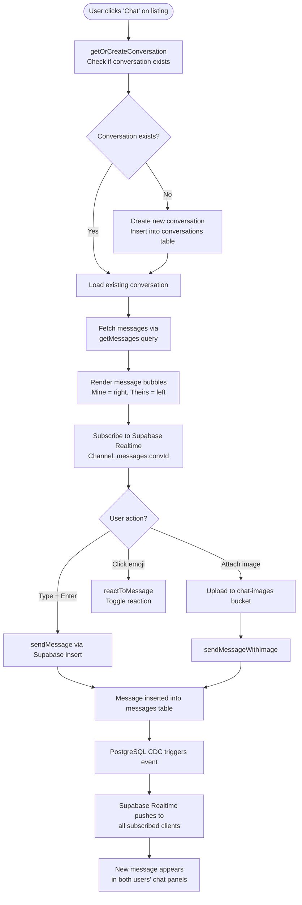

### 11.6 Complete System Flow (Overview)

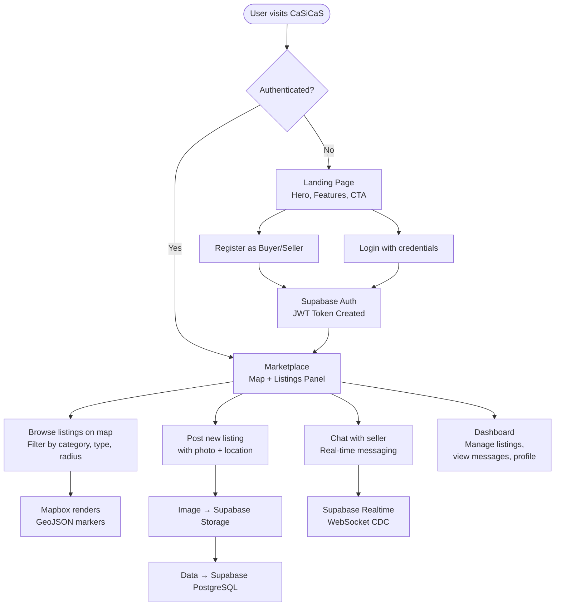

---

## 12. How CaSiCaS Helps People & Solves Problems

### For Buyers

| Problem | CaSiCaS Solution |
|---|---|
| "I see listings from Manila when I'm in Cebu" | **Geo-fenced radius** — Only see items within 1–50km of your area |
| "I don't know where the seller is located" | **Map-based browsing** — Every listing is pinned to a real location |
| "I have to use Facebook Messenger to contact sellers" | **Built-in chat** — Real-time in-app messaging with image sharing |
| "I can't filter by what I actually need" | **7 structured categories + type filter** — Find exactly what you're looking for |
| "Listings are disorganized and hard to browse" | **Card-based UI with hover previews** — Professional, clean browsing experience |

### For Sellers

| Problem | CaSiCaS Solution |
|---|---|
| "My listing gets lost among millions of posts" | **Local-only visibility** — Your listing is seen by nearby buyers who can actually transact |
| "I have to manage listings across multiple platforms" | **Dashboard** — Create, edit, delete, and view all listings in one place |
| "Buyers ghost me or never show up" | **Proximity-based matching** — Buyers are geographically close, increasing transaction completion rates |
| "I don't have a professional listing format" | **Structured listing form** — Title, description, price, category, photo, and exact location |

### For the Community

| Benefit | Impact |
|---|---|
| **Reduced carbon footprint** | Buyers travel shorter distances to transact |
| **Local economic circulation** | Money stays within Cebu's local economy |
| **Community trust** | Proximity builds accountability — sellers and buyers are neighbors |
| **Digital inclusion** | Simple, mobile-responsive interface accessible to all skill levels |
| **Safety** | Meet-up locations are transparent via the map |

---

## 13. Deployment & Infrastructure

### Deployment Architecture

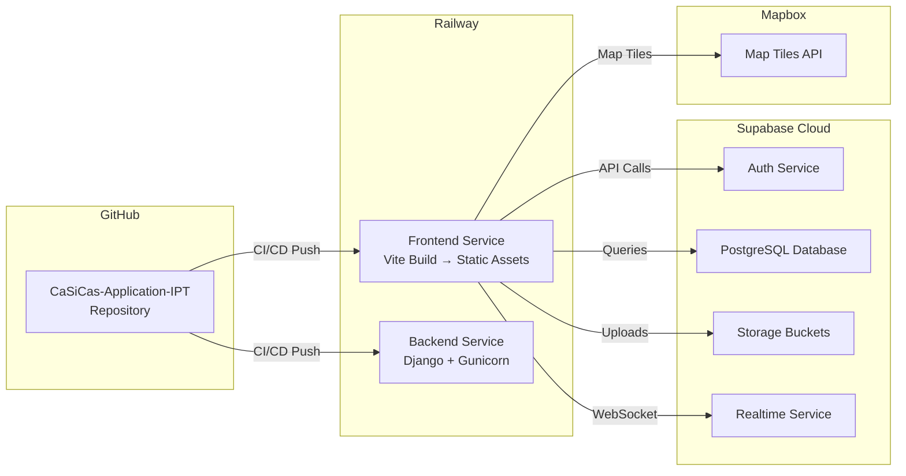

### Frontend Build Configuration

**`nixpacks.toml`** configures the Railway build:
- **Install:** `npm ci`
- **Build:** `npm run build` (Vite bundles to `dist/`)
- **Start:** `npx serve dist -s -l 3000` (static file server with SPA fallback)

### Environment Variables

| Variable | Service | Purpose |
|---|---|---|
| `VITE_SUPABASE_URL` | Supabase | Database and API endpoint |
| `VITE_SUPABASE_ANON_KEY` | Supabase | Public API key (RLS-scoped) |
| `VITE_MAPBOX_TOKEN` | Mapbox | Map tile access token |

---

## 14. File Structure

```
casicas-application/
├── frontend/                        # React SPA (Vite)
│   ├── index.html                   # Entry HTML — mounts React root
│   ├── package.json                 # Dependencies & scripts
│   ├── vite.config.js               # Vite build configuration
│   ├── nixpacks.toml                # Railway deployment config
│   ├── .env                         # Environment variables (local)
│   ├── public/                      # Static assets
│   └── src/
│       ├── main.jsx                 # App entry point — React root render
│       ├── App.jsx                  # Root component — Router + AuthProvider
│       ├── index.css                # Complete design system (Vanilla CSS)
│       ├── api/
│       │   └── client.js            # Supabase API functions (CRUD + messaging)
│       ├── lib/
│       │   └── supabase.js          # Supabase client initialization
│       ├── context/
│       │   └── AuthContext.jsx      # Authentication state & functions
│       ├── components/
│       │   ├── Navbar.jsx           # Global navigation bar
│       │   ├── Footer.jsx           # Site footer
│       │   ├── Icons.jsx            # Custom SVG icon library
│       │   ├── MapView.jsx          # Mapbox GL interactive map
│       │   ├── ListingForm.jsx      # Create/Edit listing modal
│       │   └── ChatPanel.jsx        # Real-time messaging panel
│       └── pages/
│           ├── LandingPage.jsx      # Home / Marketing page
│           ├── LoginPage.jsx        # Sign-in form
│           ├── RegisterPage.jsx     # Registration form (Buyer/Seller)
│           ├── MarketplacePage.jsx  # Map + listings browser
│           └── DashboardPage.jsx    # User dashboard (My listings, Messages, Profile)
│
├── backend/                         # Django backend (legacy / API compat)
│   ├── manage.py                    # Django management commands
│   ├── requirements.txt             # Python dependencies
│   ├── runtime.txt                  # Python version specification
│   ├── Procfile                     # Process commands for deployment
│   ├── nixpacks.toml                # Railway build config
│   ├── casicas/                     # Django project settings
│   │   ├── settings.py              # Configuration (DB, CORS, apps)
│   │   ├── urls.py                  # URL routing
│   │   ├── asgi.py                  # ASGI config (WebSocket support)
│   │   └── wsgi.py                  # WSGI config (HTTP)
│   ├── accounts/                    # User accounts app
│   ├── listings/                    # Listings CRUD app
│   └── messaging/                   # Real-time messaging app
│
├── DOCUMENTATION.md                 # ← This file
├── DEPLOYMENT.md                    # Deployment instructions
├── railway.json                     # Railway project configuration
└── .gitignore                       # Git exclusions
```

---

## 15. Conclusion

**CaSiCaS** is a production-ready, geo-fenced marketplace application that addresses the real-world needs of Cebuano communities. By combining modern web technologies — **React 19**, **Supabase**, and **Mapbox GL JS** — with a focus on hyper-local transactions, CaSiCaS delivers a platform that is:

- **Functional** — Full CRUD for listings, real-time messaging with reactions and image sharing, interactive map-based browsing with radius filtering.
- **Secure** — JWT authentication, Row Level Security, parameterized queries, storage bucket policies, and XSS prevention via React's built-in escaping.
- **Scalable** — Supabase handles database, auth, storage, and real-time at scale; the frontend is a lightweight SPA served as static assets.
- **User-Centric** — Designed for the Cebuano context with Philippine Peso pricing, local geo-center, category-based filtering, and clean responsive UI.
- **Deployable** — Fully deployed on Railway with CI/CD integration from GitHub.

The system architecture eliminates the need for a traditional custom API server by leveraging Supabase's direct client SDK, reducing development complexity while maintaining enterprise-grade security through PostgreSQL Row Level Security policies.

---

> **Developed by:** *CaSiCaS Development Team*  
> **Course:** *Information and Programming Technology (IPT)*  
> **Institution:** *Cebu Eastern College, Inc.*  
> **Year:** *2026*

---

*This document serves as the official technical documentation and defense material for the CaSiCaS Application project.*
